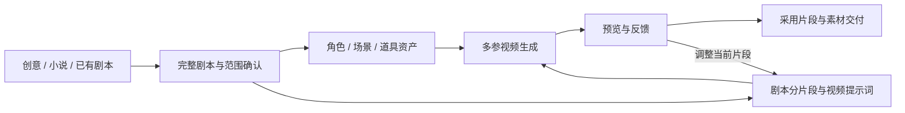

<p>
  <a href="https://github.com/HBAI-Ltd/Toonflow-app">
    
  </a>
  &nbsp;|&nbsp;
  <a href="https://gitee.com/HBAI-Ltd/Toonflow-app">
    
  </a>
  &nbsp;|&nbsp;
  <a href="https://gitcode.com/HBAI-Ltd/Toonflow-app">
    
  </a>
</p>

<p align="center">
  <strong>简体中文</strong> |
  <a href="https://github.com/HBAI-Ltd/Toonflow-app/blob/master/docs/README.zhtw.md">繁體中文</a> |
  <a href="https://github.com/HBAI-Ltd/Toonflow-app/blob/master/docs/README.en.md">English</a> |
  <a href="https://github.com/HBAI-Ltd/Toonflow-app/blob/master/docs/README.th.md">ไทย</a> |
  <a href="https://github.com/HBAI-Ltd/Toonflow-app/blob/master/docs/README.vi.md">Tiếng Việt</a> |
  <a href="https://github.com/HBAI-Ltd/Toonflow-app/blob/master/docs/README.ja.md">日本語</a> |
  <a href="https://github.com/HBAI-Ltd/Toonflow-app/blob/master/docs/README.ru.md">Русский</a>
  <br />
  <sub>其他语言暂为旧版文档，当前版本请以简体中文为准。</sub>
</p>

<div align="center">

<p align="center">
  
</p>

<a href="https://git.io/typing-svg">
  <picture>
    <source media="(prefers-color-scheme: dark)" srcset="https://readme-typing-svg.demolab.com?font=Fira+Code&size=40&duration=3000&pause=1000&color=FFFFFF&center=true&vCenter=true&width=600&lines=Toonflow;AI%E7%9F%AD%E5%89%A7%E5%B7%A5%E5%8E%82;%E8%AE%A9%E7%81%B5%E6%84%9F%E6%88%90%E4%B8%BA%E7%9C%8B%E5%BE%97%E8%A7%81%E7%9A%84%E6%95%85%E4%BA%8B" />
    
  </picture>
</a>

<p align="center">
  <a href="https://github.com/HBAI-Ltd/Toonflow-app/stargazers">
    
  </a>
  <a href="./LICENSE">
    
  </a>
  <a href="https://github.com/HBAI-Ltd/Toonflow-app/releases">
    
  </a>
</p>
<p align="center">
  <a href="https://github.com/HBAI-Ltd/Toonflow-app/network/members">
    
  </a>
  <a href="https://atomgit.com/HBAI-Ltd/Toonflow-app">
    
  </a>
  <a href="https://discord.gg/HEjKmpNpAZ">
    
  </a>
</p>
<p align="center">
  <a href="https://github.com/HBAI-Ltd/Toonflow-app/issues">
    
  </a>
  <a href="https://github.com/HBAI-Ltd/Toonflow-app/graphs/contributors">
    
  </a>
  <a href="https://github.com/HBAI-Ltd/Toonflow-app/commits">
    
  </a>
</p>
<p align="center">
  &nbsp;
  &nbsp;
  &nbsp;
  
</p>

> 🚀 **一站式短剧创作**：从剧本到角色，从素材到视频，在无限画布上与 AI 一起把故事做出来。

</div>

<div align="center">
  <table>
    <tr>
      <td width="50%" align="center">
        <a href="./docs/gStar.png">
          
        </a>
      </td>
      <td width="50%" align="center">
        <a href="./docs/gvp.jpg">
          
        </a>
      </td>
    </tr>
  </table>
</div>

<p align="center">
  <a href="https://github.com/HBAI-Ltd/Toonflow-app/releases">下载客户端</a> ·
  <a href="https://bcn73rj0zcx7.feishu.cn/docx/Ps90dTzumoFppLxAHqocimGenFf?from=from_copylink">使用教程</a> ·
  <a href="https://api.toonflow.net/console/plugIn">插件市场</a> ·
  <a href="https://scnpmvaimya1.feishu.cn/docx/I6nZdSHBeoimGQx5HvtcrYgMntd">开发者文档</a> ·
  <a href="https://api.toonflow.net/">官方模型平台</a>
</p>

---

## ✨ 在一张画布里完成创作

Toonflow 将对话、文件与节点放进同一个工作区。你可以从一句话开始，也可以带着已有剧本和素材继续制作：先确定故事，再准备资产，将剧本拆成片段，逐段生成与调整视频。

| 能力 | 你可以做什么 |
| --- | --- |
| **无限画布** | 自由摆放文本、图片、音频、视频和生成节点；连接素材、框选、复制、打组，并在多张画布之间切换。 |
| **Agent 协作** | 通过对话整理剧本、读取工作区文件、编辑节点与提示词，使用问题表单确认需求和阶段方案。 |
| **图片与视频生成** | 在节点中选择模型、设置参数、引用真实素材并查看输出，保留可以继续修改的制作过程。 |
| **素材管理** | 将文件直接拖入画布或批量上传，在素材库预览图片、音频和视频，并在节点中替换素材。 |
| **3D 导演台** | 用文字生成场景、动作与运镜，在三维画面中调整取景和光照，记录关键帧并导出图片或视频，用于镜头预演。 |
| **模型提供方** | 分别配置文本模型和媒体模型，接入预设或自定义提供方；媒体接口由提供方适配。 |
| **插件与技能** | 安装节点、工具和 Markdown 技能，扩展画布能力、Agent 工具和创作方法。 |
| **MCP 与个性化** | 通过 MCP 让外部工具接入 Toonflow，管理全局说明和本地 Markdown 记忆，让不同工作区沿用你的创作偏好。 |

---

## 📦 应用场景

- **短剧与漫剧制作**：围绕角色、场景和片段组织素材，持续迭代一集或一组故事。
- **小说视听化**：从原著提取内容，改编成可审阅的剧本与镜头方案。
- **短视频创作**：从一个主题或灵感开始，准备画面素材并生成视频片段。
- **角色与场景设计**：统一视觉风格，积累可以在后续制作中复用的资产。
- **动作与镜头预演**：在 3D 导演台中尝试构图、走位和运镜，再导出参考。

---

## 🎬 从剧本到视频

内置的视频制作工作流围绕可审阅的阶段成果推进。已有剧本或素材可以直接接续，局部修改也可以只处理受影响的部分。



- **资产来自剧本。** 先明确角色、场景、道具和视觉风格，再制作可复用的资产；角色参考按需要组织面部与正、侧、背三视图。
- **提示词来自完整片段。** 一个片段可以包含多个镜头，动作、对白、声音和前后衔接共同组成视频提示词。
- **素材直接参与生成。** 在模型支持多参输入时，将角色图、场景图、道具图等作为实际参考传给视频节点；首帧、首尾帧等流程按具体需求使用。
- **由你决定采用什么。** 内置工作流要求展示阶段成果，并在消耗算力生成前确认具体方案；已授权的同一批次沿用既有确认，调整与额外生成另行核对。

模型能力、生成规格与费用取决于所配置的服务。生成得到的片段需要预览和选择，最终剪辑与合成按项目需要继续完成。

---

## 🚀 下载与快速上手

### 下载客户端

前往 [GitHub Releases](https://github.com/HBAI-Ltd/Toonflow-app/releases)，按系统和处理器架构选择安装包，具体文件与说明以对应发布页为准。

| 系统 | 架构 | 安装方式 |
| --- | --- | --- |
| Windows | x64 | 运行 `toonflow-<版本>-Setup.exe`，选择安装目录并按向导完成安装。 |
| macOS | Apple Silicon / arm64 | 选择 `macArm64` 对应的 DMG，将应用复制到“应用程序”后运行。 |
| macOS | Intel / x64 | 选择 `macX64` 对应的 DMG，将应用复制到“应用程序”后运行。 |

Windows 安装器会检查 WebView2，缺少运行时时提示安装。当前 macOS 构建未做 Developer ID 签名与公证，首次打开可能需要按系统提示处理；自行构建的准备步骤见下方开发说明。

### 开始第一个项目

1. **配置模型。** 首次启动可选择“登录 TF-Router 自动配置”，也可以添加私有提供商，或先选择“稍后配置”浏览界面。
2. **检查可用模型。** 在“设置 → 文本模型”配置 Agent 使用的模型，在“设置 → 媒体模型”配置图片和视频生成所需的提供方与模型。填写 TF-Router 的文本模型 Key 后会自动获取模型列表。
3. **创建工作区。** 从首页输入创作灵感，或新建、打开本地工作区，准备剧本和参考素材。
4. **搭建画布。** 拖入文件、通过右键菜单添加节点，也可以让 Agent 按需求整理内容和节点。
5. **逐阶段制作。** 审阅剧本、资产与视频方案，确认生成范围后执行，预览结果并提出调整意见。

[TF-Router](https://api.toonflow.net/) 是 Toonflow 的官方模型中转平台，也可以使用其他已支持或自行适配的提供方。模型调用需要相应的 API Key，图像、视频等生成消耗由对应服务计费。

需要图文操作说明时，请查看 [使用教程](https://bcn73rj0zcx7.feishu.cn/docx/Ps90dTzumoFppLxAHqocimGenFf?from=from_copylink)。画布底部的帮助菜单也提供教程、反馈和交流入口。

---

## 🧩 插件与模型扩展

通过“设置 → 插件市场”发现和管理节点、工具与技能；市场顶部可以直接打开 [网页版市场](https://api.toonflow.net/console/plugIn) 和 [开发者文档](https://scnpmvaimya1.feishu.cn/docx/I6nZdSHBeoimGQx5HvtcrYgMntd)。市场需要 TF-Router API Key，未配置时会提示填写。

| 扩展类型 | 用途 | 开发入口 |
| --- | --- | --- |
| 节点 | 为画布增加交互组件、输入输出端口与节点操作。 | [节点脚手架](./packages/nodeScaffold/readme.md) · [内置节点](./packages/nodes/) |
| 工具 | 为 Agent 增加工作区操作、搜索、媒体生成等能力，可附带交互 UI。 | [工具脚手架](./packages/toolScaffold/readme.md) · [内置工具](./packages/tools/) |
| 技能 | 用 `SKILL.md` 和附属资料描述创作流程、方法与操作约定。 | [内置技能](./packages/skills/) |
| 提供方 | 适配不同平台的模型列表、请求参数和媒体返回结果。 | [提供方实现](./packages/providers/src/) |

节点与工具的配置表单统一使用 `@form-create/element-ui` 的规则；有必填项未填写时，配置按钮会显示红点。工具只接收自身配置，宿主不向工具直接传递完整应用设置。

媒体接口包含图片、视频和音频的扩展类型，实际能力由各提供方实现；当前内置 TF-Router 媒体适配提供图片与视频生成。技能既可以全局安装，也可以放在当前工作区的 `skill/` 目录，同名时优先使用工作区版本。

需要从外部 Coding 工具操作 Toonflow 时，在“设置 → MCP”开启服务并复制客户端配置，支持 HTTP 与 stdio 连接。画布和节点等界面操作需要保持 Toonflow 窗口或网页打开，详见 [MCP 接入说明](./packages/mcp/README.md)。

<details>
<summary><strong>通过网页唤起桌面安装插件</strong></summary>

安装桌面客户端后，网页可通过 `toonflow://install` 请求安装插件。应用会先展示类型、文件名和下载地址，用户确认后再下载与安装。

```ts
const link = new URL("toonflow://install");
link.searchParams.set("type", "node");
link.searchParams.set("url", "https://example.com/plugins/exampleNode.umd.js");
window.location.href = link.href;
```

| `type` | 文件格式 | 安装位置 |
| --- | --- | --- |
| `node` | `.umd.js` | `data/nodes/` |
| `tool` | `.tool.js` | `data/tools/` |
| `skill` | `SKILL.md`、`.zip`、`.tar`、`.tar.gz`、`.tgz` | `data/skills/<name>/` |
| `provider` | 媒体提供方 `.ts` | `data/providers/` |

下载地址须为 HTTP/HTTPS，文件名来自 URL 路径。同名节点、工具和技能在版本更高时允许更新；覆盖同版本或降级需在开发者选项中使用强制安装，提供方不覆盖同名项。

普通插件与技能包最多 20 MB，技能解压后也受此限制；提供方最多 2 MB。技能包支持 ZIP 和 TAR，须包含带有 `name`、`description` frontmatter 的 `SKILL.md`，附属资源放在其所在目录内。TAR 包使用普通 USTAR 格式，不包含链接及 PAX/GNU 扩展条目。

Windows 安装器负责注册协议；macOS 需要将应用放入 `/Applications` 或 `~/Applications`。普通浏览器开发模式不注册桌面协议。

</details>

---

## 🛠️ 开发与构建

前端、业务服务和桌面端在同一个 Bun Workspaces 仓库中维护。

| 层级 | 技术 |
| --- | --- |
| 运行时与包管理 | Bun 1.3.14、Bun Workspaces |
| 前端 | Vue 3、Vite、TypeScript、Pinia、Element Plus、Vue Flow |
| 服务端 | Bun、Express 5、Zod |
| Agent | Pi Agent SDK、工具插件、Markdown 技能与记忆 |
| 桌面 | Electrobun；Windows 使用 WebView2 和 NSIS 安装器 |
| 3D 与媒体 | Three.js、FFmpeg、可扩展的媒体提供方 |

### 本地开发

先安装 Git 和项目指定版本的 [Bun](https://bun.sh/)，然后执行：

```sh
git clone https://github.com/HBAI-Ltd/Toonflow-app.git
cd Toonflow-app
bun install

# 首次开发或修改插件后，构建节点和工具并同步到 data/
bun run dev:plugins

# 同时启动 Web 与业务 Server
bun run dev
```

打开 `http://localhost:5173`。独立 Server 默认监听 `3000`，Web 开发服务会代理 API 请求。`dev` 不会自动构建或同步插件，因此首次启动需要上面的 `dev:plugins` 步骤。

### 常用命令

以下命令在仓库根目录执行：

| 命令 | 用途 |
| --- | --- |
| `bun run dev:web` | 单独启动 Web 开发服务。 |
| `bun run dev:server` | 单独启动业务 Server。 |
| `bun run dev:plugins` | 构建节点和工具，并同步到开发数据目录。 |
| `bun run dev:desktop` | 同步开发插件、构建 Web，并启动桌面应用。 |
| `bun run build` | 构建工具、Web、Server、MCP，并输出技能和提供方文件。 |
| `bun run build:nodes` | 构建节点到 `build/nodes/`，不写入 `data/nodes/`。 |
| `bun run build:tools` | 构建工具到 `build/tools/`，不写入 `data/tools/`。 |
| `bun run start:server` | 运行 `build/server/` 中已构建的服务。 |
| `bun run build:desktop` | 构建当前平台的桌面应用及随包资源。 |
| `bun run package:desktop` | 生成当前平台的 Windows NSIS 安装包或 macOS DMG。 |
| `bun run typecheck` | 单独执行各工作区的类型检查。 |

构建与类型检查分别执行。新增、移动或删除业务接口后，在 `apps/server` 执行 `bun run routes` 生成路由。

<details>
<summary><strong>在本机运行构建后的 Web 与 Server</strong></summary>

首次从源码运行，完成依赖安装后执行：

```sh
bun run dev:plugins
bun run build
bun run start:server
```

然后打开 `http://localhost:3000`。这套命令使用仓库根目录的默认 `data/`；`build` 本身不初始化节点。迁移到其他目录或机器时，需一并处理节点、配置和工作区，不能只复制 `build/` 就视作完整安装。

独立 Server 采用单进程运行。桌面端复用同一个 `createApp`，在主进程监听系统分配的本机端口。目录选择、原生保存与桌面更新等接口仅由桌面宿主提供。

</details>

<details>
<summary><strong>桌面构建准备：Windows 与 macOS</strong></summary>

桌面脚本支持 Windows x64、macOS arm64 和 macOS x64，需要在对应系统与架构上构建。

**Windows x64**

使用 Electrobun 2.0.1。打包需要 NSIS，默认查找 `C:/Program Files (x86)/NSIS/makensis.exe`，可通过 `NSIS_PATH` 指定路径。首次打包会下载并验证微软 WebView2 引导程序。

```sh
bun run build:desktop
bun run package:desktop
```

安装包输出到 `build/desktop/artifacts/toonflow-<版本>-Setup.exe`。

**macOS**

先安装 Xcode Command Line Tools。Apple Silicon 使用 Electrobun 2.0.1；Intel Mac 使用 `compat/macIntel/` 中的 Electrobun 1.18.1 兼容构建，需先准备其依赖：

```sh
# 仅 Intel Mac 需要
cd compat/macIntel
bun install --frozen-lockfile
cd ../..
```

在对应架构的 Mac 上生成原生启动库，然后构建：

```sh
bun packages/startup/scripts/buildMac.ts
bun run build:desktop
bun run package:desktop
```

启动库脚本会下载固定版本的 ThorVG 源码并校验摘要。产物分别位于 `build/desktop/artifacts/macArm64/` 和 `build/desktop/artifacts/macX64/`。

当前 macOS 测试包未做 Developer ID 签名与公证。对于自己构建且确认来源的测试应用，若被隔离属性拦截，可仅移除该应用的隔离属性，路径按实际位置调整：

```sh
xattr -dr com.apple.quarantine "/Applications/toonflow.app"
```

**类型检查与 SDK**

若 Windows x64 或 Apple Silicon 在首次构建前单独进行类型检查，先准备 Electrobun SDK：

```sh
bun apps/desktop/node_modules/electrobun/bin/electrobun.cjs prepare
bun run typecheck
```

Intel Mac 在安装兼容 SDK 后，先运行桌面开发或构建命令生成适配文件。类型检查不会隐式安装依赖或编译原生库。

</details>

<details>
<summary><strong>发布、更新与插件同步</strong></summary>

- [Debug 工作流](./.github/workflows/debug.yml) 支持手动选择 Windows x64、Apple Silicon、Intel Mac 或全部目标，产物保留 7 天，不创建 Release。
- [Release 工作流](./.github/workflows/release.yml) 在推送 `vX.Y.Z` 标签后构建桌面包，并上传到 GitHub Release。可通过 Actions Variable `UPDATE_BASE_URL` 配置客户端更新地址。
- CI 构建和归档检查不等于已验证真实安装、GUI 启动或 macOS Gatekeeper。

独立更新服务与业务 Server 分开运行，默认地址为 `http://127.0.0.1:8091`。其配置、部署与发布规则见 [更新服务说明](./apps/updateServer/readme.md)。

```sh
bun run start:updateServer

# 首次基线，版本号仅为示例
bun run release:desktop 2.0.0 --initial
bun run publish:update build/desktop/releases/2.0.0

# 服务器保留上一版时，构建并发布下一版本
bun run release:desktop 2.0.1
bun run publish:update build/desktop/releases/2.0.1
```

Mac 发布目录增加 `macX64/` 或 `macArm64/`，例如 `build/desktop/releases/macArm64/2.0.1`。同一平台、架构和版本不能重复发布；普通构建不访问更新服务器，非 initial 的 release 才生成增量更新。GitHub Release 工作流生成完整更新包，不自动发布到独立更新服务。

桌面用户可在“设置 → 关于”检查更新、下载并重启应用。Windows 更新交换程序目录，保留 `data/` 和 `WebView2/`；卸载时也默认保留这些数据，选择“同时删除用户数据”才会一并清理。

内置节点与工具按构建 hash 同步：升级或降级后首次启动会替换同名内置插件；Windows 同版本重装也会触发同步。普通重启不重复覆盖。技能和提供方按首次初始化规则处理，保留已有文件；第三方插件和用户素材不随内置节点、工具的同步被覆盖。

</details>

### 项目结构

```text
apps/
  web/                 Vue 页面、设置、工作区与画布
  server/              业务接口与 Agent 运行时，桌面共享此服务
  desktop/             Electrobun 入口、构建脚本与安装器
  updateServer/        独立更新文件服务器与发布脚本
packages/
  assets/              共享图片与图标
  nodes/               内置画布节点
  nodeScaffold/        节点开发脚手架与运行时
  tools/               Agent 工具插件
  toolScaffold/        工具开发脚手架与运行时
  providers/           文本与媒体模型提供方
  skills/              Markdown 技能及附属资料
  mcp/                 MCP 服务与协议适配
  ffmpeg/              FFmpeg 能力
  startup/             原生启动窗口与动画
compat/macIntel/       Intel Mac 兼容构建
build/                 构建产物
data/                  本机运行数据，不提交到仓库
```

---

## 📝 工作区、记忆与隐私

项目使用本地工作区组织画布、文本和素材。画布结构保存为 JSON，文本节点正文保存为 Markdown，媒体与 3D 模型等文件保存在工作区的素材目录中；备份项目时请保留完整目录。

在“设置 → 个性化”中可以管理：

- **Toonflow 说明**：全局 `AGENTS.md`，为所有聊天提供额外说明和上下文。
- **Toonflow 记忆**：所有工作区共用的本地 Markdown 记忆，默认启用，可查看、编辑、删除或关闭。

工作区根目录的 `AGENTS.md` 也会在对话中自动读取，用于补充该项目的具体要求。

全局配置与已安装插件位于应用的 `data/`，项目内容位于各自工作区。调用在线模型时，请求所需的提示词和参考素材会发送给所选服务；本地保存不代表模型在本地运行。

“设置 → 隐私”提供匿名使用统计开关，默认开启，可随时关闭。统计用于了解功能使用情况，不包含提示词、对话、文件内容、项目名称、路径、账号或密钥。

---

## 💬 交流与反馈

| 入口 | 用途 |
| --- | --- |
| [使用教程](https://bcn73rj0zcx7.feishu.cn/docx/Ps90dTzumoFppLxAHqocimGenFf?from=from_copylink) | 查看使用方法与操作说明。 |
| [需求 / BUG 反馈表](https://docs.qq.com/smartsheet/form/EmvmQBrmlPmr%2Fss_vsqk2v%2FvhiGzE?tab=ss_vsqk2v) | 提交复现步骤、应用版本和相关截图。 |
| [GitHub Issues](https://github.com/HBAI-Ltd/Toonflow-app/issues) | 跟踪公开问题和改进建议。 |
| [加入交流群](https://work.weixin.qq.com/u/vc36adcc89845edcbe?v=5.0.3.63936&bb=85b8d228e8) | 交流创作经验与使用问题；应用内帮助菜单也可显示入群二维码。 |
| [商务合作](https://work.weixin.qq.com/u/vc0f54596c5837d05a?v=5.0.8.70675) | 仅用于商务接洽，使用答疑请前往交流群，需求和 BUG 请通过反馈入口提交。 |
| [联系邮箱](mailto:ltlctools@outlook.com) | ltlctools@outlook.com |

我们正在全职投入 Toonflow，为爱发电。欢迎分享作品、友善反馈，也请为回复留出一些时间。这里是创作者与开发者共同交流的社区，感谢彼此的耐心与尊重。

---

## 🤝 参与共建

欢迎提交问题、改进文档、开发插件，或通过 Pull Request 贡献代码。开始修改前请阅读仓库的 [开发规范](./AGENTS.md)，较大的改动建议先在 Issue 中说明问题和方案。

提交时请写清改动目的、复现方式与实际完成的验证。涉及模型服务、桌面安装或媒体生成时，请区分类型检查、构建结果与真实运行结果，并避免提交 API Key、个人设置和工作区素材。

---

## 🙏 致谢

感谢 Bun、Vue、Vite、Element Plus、Vue Flow、Electrobun、Express、Pi、Three.js、FFmpeg、form-create 等项目，以及所有贡献者和提供反馈的创作者。

感谢以下伙伴对 Toonflow 的支持：

| 伙伴 | 链接 |
| --- | --- |
|  秘塔 | [访问网站](https://metaso.cn/minimax-h3/?s=toon) |
|  APIMart | [访问网站](https://go.apimart.ai/gh-toonflow-app) |
| 算能云 | [访问网站](https://www.sophnet.com/) |
| 腾讯混元 3D | [访问网站](https://3d.hunyuan.tencent.com/) |
| 智星云 | [访问网站](https://www.ai-galaxy.com/) |

---

## 📜 许可证

Toonflow 采用 **MIT** 许可证，完整条款见 [LICENSE](./LICENSE)。

Copyright (c) 2026 HBAI-Ltd

第三方依赖及随附资源仍遵循各自的许可证与版权声明。

---

## ⭐ Star History

[](https://www.star-history.com/#HBAI-Ltd/Toonflow-app&Date)

<div align="center">

**Toonflow · 和创作者一起，把故事做出来。**

Copyright © 2026 HBAI-Ltd

</div>


