<p>
  <a href="https://github.com/HBAI-Ltd/Toonflow-app">
    
  </a>
  &nbsp;|&nbsp;
  <a href="https://gitee.com/HBAI-Ltd/Toonflow-app">
    
  </a>
  &nbsp;|&nbsp;
  <a href="https://atomgit.com/HBAI-Ltd/Toonflow-app">
    
  </a>
</p>

<p align="center">
  <a href="../README.md">简体中文</a> |
  <a href="./README.zhtw.md">繁體中文</a> |
  <a href="./README.en.md">English</a> |
  <a href="./README.th.md">ไทย</a> |
  <a href="./README.vi.md">Tiếng Việt</a> |
  <a href="./README.ja.md">日本語</a> |
  <strong>Русский</strong>
</p>

<div align="center">

<p align="center">
  
</p>

<a href="https://git.io/typing-svg">
  <picture>
    <source media="(prefers-color-scheme: dark)" srcset="https://readme-typing-svg.demolab.com?font=Fira+Code&size=40&duration=3000&pause=1000&color=FFFFFF&center=true&vCenter=true&width=600&lines=Toonflow;%D0%98%D0%98-%D1%81%D1%82%D1%83%D0%B4%D0%B8%D1%8F%20%D0%BA%D0%BE%D1%80%D0%BE%D1%82%D0%BA%D0%B8%D1%85%20%D0%B4%D1%80%D0%B0%D0%BC;%D0%9E%D0%B6%D0%B8%D0%B2%D0%BB%D1%8F%D0%B9%D1%82%D0%B5%20%D1%81%D0%B2%D0%BE%D0%B8%20%D0%B8%D1%81%D1%82%D0%BE%D1%80%D0%B8%D0%B8" />
    
  </picture>
</a>

<p align="center">
  <a href="https://github.com/HBAI-Ltd/Toonflow-app/stargazers">
    
  </a>
  <a href="../LICENSE">
    
  </a>
  <a href="https://github.com/HBAI-Ltd/Toonflow-app/releases">
    
  </a>
</p>
<p align="center">
  <a href="https://github.com/HBAI-Ltd/Toonflow-app/network/members">
    
  </a>
  <a href="https://atomgit.com/HBAI-Ltd/Toonflow-app">
    
  </a>
  <a href="https://discord.gg/HEjKmpNpAZ">
    
  </a>
</p>
<p align="center">
  <a href="https://github.com/HBAI-Ltd/Toonflow-app/issues">
    
  </a>
  <a href="https://github.com/HBAI-Ltd/Toonflow-app/graphs/contributors">
    
  </a>
  <a href="https://github.com/HBAI-Ltd/Toonflow-app/commits">
    
  </a>
</p>
<p align="center">
  &nbsp;
  &nbsp;
  &nbsp;
  
</p>

<p align="center">
  <a href="https://trendshift.io/repositories/24197?utm_source=trendshift-badge&amp;utm_medium=badge&amp;utm_campaign=badge-trendshift-24197" target="_blank" rel="noopener noreferrer">
    
  </a>
</p>

**Открытая ИИ-платформа для создания коротких драм, анимированных комиксов и видео**

> 🚀 **Всё для создания коротких драм**：Пишите сценарии, управляйте материалами, создавайте изображения и видео, организуя весь творческий процесс на бесконечном холсте.

</div>

<div align="center">
  <table>
    <tr>
      <td width="50%" align="center">
        <a href="./gStar.png">
          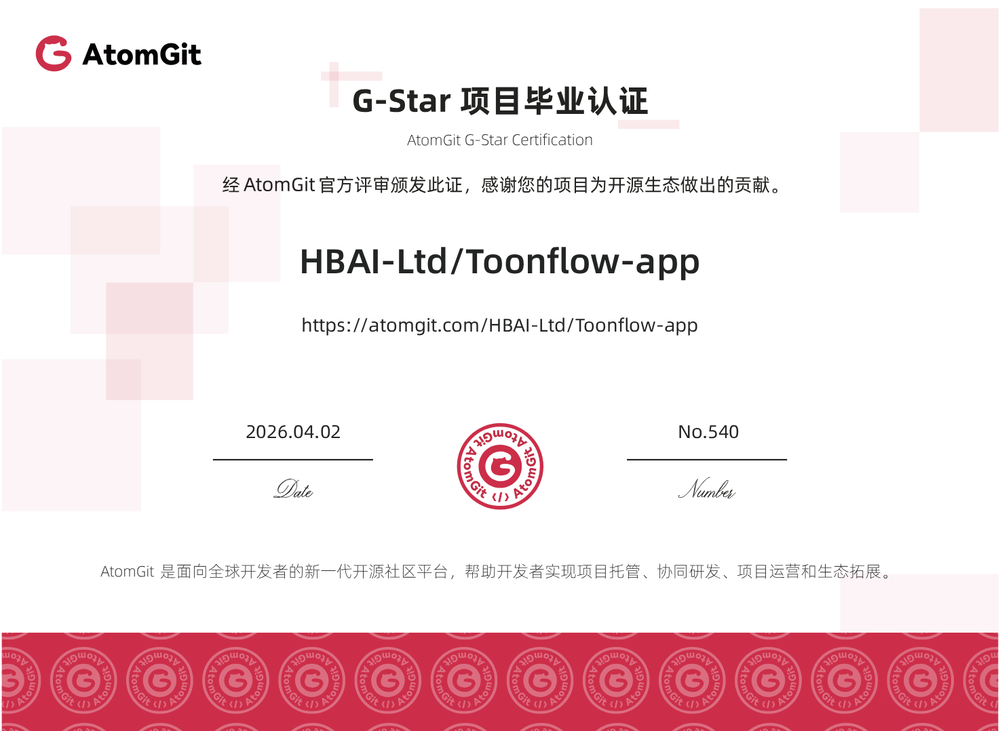
        </a>
      </td>
      <td width="50%" align="center">
        <a href="./gvp.jpg">
          
        </a>
      </td>
    </tr>
  </table>
</div>

<p align="center">
  <a href="https://github.com/HBAI-Ltd/Toonflow-app/releases">Скачать приложение</a> ·
  <a href="https://bcn73rj0zcx7.feishu.cn/docx/Ps90dTzumoFppLxAHqocimGenFf?from=from_copylink">Руководство пользователя</a> ·
  <a href="https://api.toonflow.net/console/plugIn">Каталог плагинов</a> ·
  <a href="https://qcn7xdsqgc4z.feishu.cn/docx/KNBNd9naqolsy6xjAOCcEAkqnRd">Документация для разработчиков</a> ·
  <a href="https://api.toonflow.net/">Официальная платформа моделей</a>
</p>

---

## 1. 💛 Спонсоры и поддержка

Благодарим следующих партнёров за поддержку открытого проекта Toonflow.

<table>
  <tr>
    <td width="50%" valign="top">
      <a href="https://metaso.cn/minimax-h3/?s=toon"> <strong>Metaso</strong></a>
      <br />
      <sub>Доступная генерация видео с MiniMax H3: всего ¥0.09 за секунду в 768P и ¥0.15 за секунду в 2K (CNY, китайские юани). Поддерживаются нативное разрешение 2K, синхронизация звука и изображения, API, совместимый с протоколом OpenAI, ComfyUI и бесконечные холсты. Собственный GPU не требуется. <a href="https://metaso.cn/minimax-h3/?s=toon">Зарегистрируйтесь по специальной ссылке</a>, чтобы получить подарочные средства и эксклюзивные предложения. По вопросам сотрудничества обращайтесь в WeChat: metasota12.</sub>
    </td>
    <td width="50%" valign="top">
      <a href="https://go.apimart.ai/gh-toonflow-app"> <strong>APIMart</strong></a>
      <br />
      <sub>Благодарим APIMart за предоставленные проекту вычислительные ресурсы! Это доступная API-платформа для генерации изображений и видео с ИИ. GPT-Image-2 стоит от $0.006 за изображение: более 160 изображений за $1. Для изображений и видео используется единый асинхронный API: отправьте задачу, получите её ID, а затем результат через обратный вызов. Обрабатывайте пакеты из 10,000 изображений без тайм-аутов и меняйте модели без изменения кода. Оплата по факту использования, без абонентской платы. Начать работу можно сразу после <a href="https://go.apimart.ai/gh-toonflow-app">регистрации по этой ссылке</a>.</sub>
    </td>
  </tr>
</table>

<details>
<summary><strong>👉 Стать спонсором 👈</strong></summary>

<p align="center">
  
</p>

<p align="center"><sub>Этот контакт предназначен только для делового сотрудничества; техническая поддержка здесь не предоставляется. Вопросы по использованию можно обсудить в группах сообщества, а пожелания и сообщения об ошибках — отправить через форму обратной связи. Спасибо за понимание.</sub></p>

</details>

---

## 2. 🌟 Возможности

Toonflow — открытая ИИ-платформа для создания коротких драм, анимированных комиксов и коротких видео. Она объединяет сценарии, материалы и видеоклипы на одном бесконечном холсте.

| Возможность | Описание |
| --- | --- |
| 🏠 **Локальное развёртывание** | Храните проекты и материалы на своём устройстве или сервере. Доступны настольное приложение, Docker и установка на сервер. |
| 🖼️ **Бесконечный холст** | Размещайте сценарии, персонажей, сцены и видеоклипы на одном холсте. |
| 🔌 **MCP** | Подключайте внешние инструменты и сервисы через MCP. |
| 🧩 **Каталог плагинов** | Добавляйте узлы, инструменты и творческие возможности через [каталог плагинов](https://api.toonflow.net/console/plugIn). |
| 🤖 **Открытая система агентов** | Открытый доступ к промптам, инструментам и A2A для настройки поведения агентов и взаимодействия с внешними агентами. |
| 🔧 **Свободное подключение моделей** | Настраивайте сторонние API или подключайте локальные ComfyUI и LLM. |

---

## 3. 📸 Скриншоты

<div align="center">

<a href="./screenshots/projectHome.png">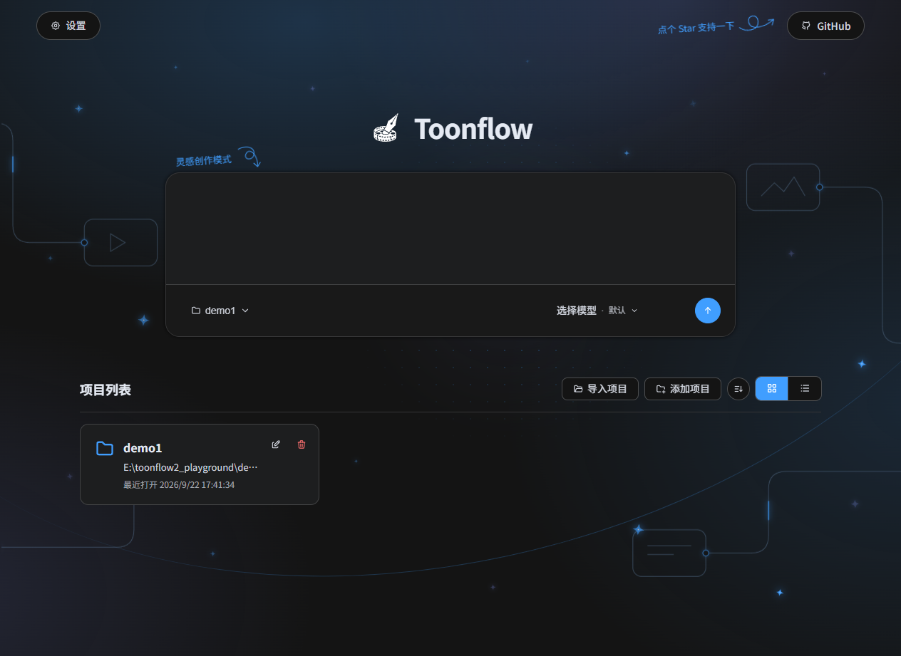</a><br /><sub>Главная страница проектов и работа с идеями</sub>

<a href="./screenshots/quickStart.png">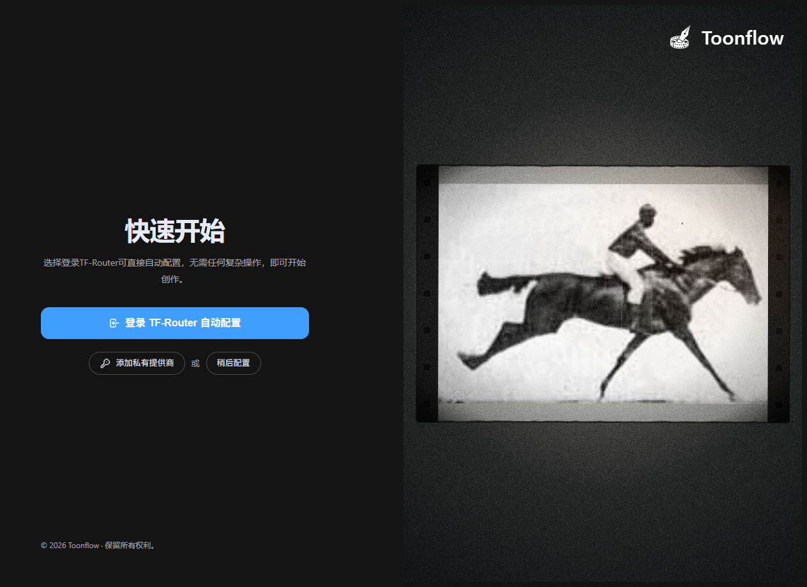</a><br /><sub>Первый запуск и быстрая настройка</sub>

<a href="./screenshots/canvasDark.png">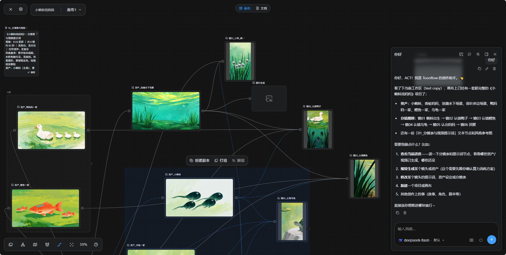</a><br /><sub>Творческий холст · Тёмная тема</sub>

<a href="./screenshots/canvasLight.png">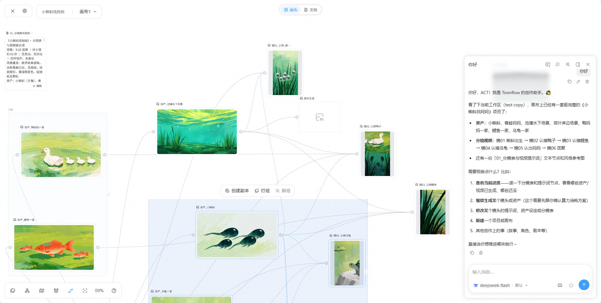</a><br /><sub>Творческий холст · Светлая тема</sub>

<a href="./screenshots/assetCanvas.png">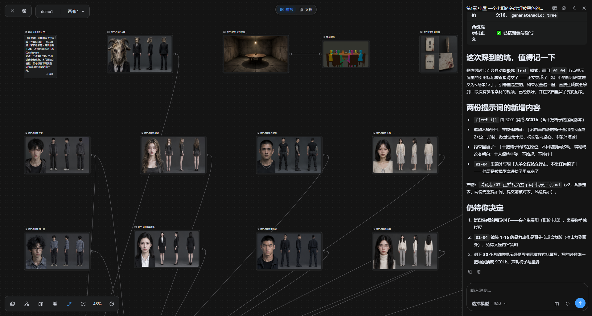</a><br /><sub>Материалы персонажей, сцен и реквизита</sub>

<a href="./screenshots/directorStudio.png">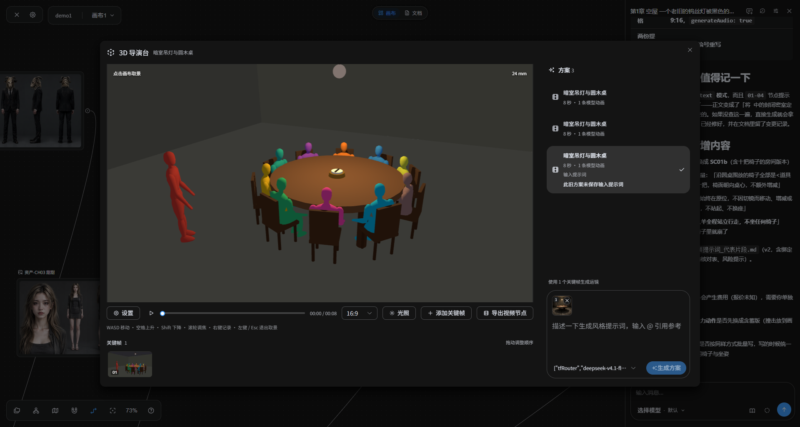</a><br /><sub>3D-студия режиссёра и предварительная визуализация кадров</sub>

<a href="./screenshots/characterImageGeneration.png">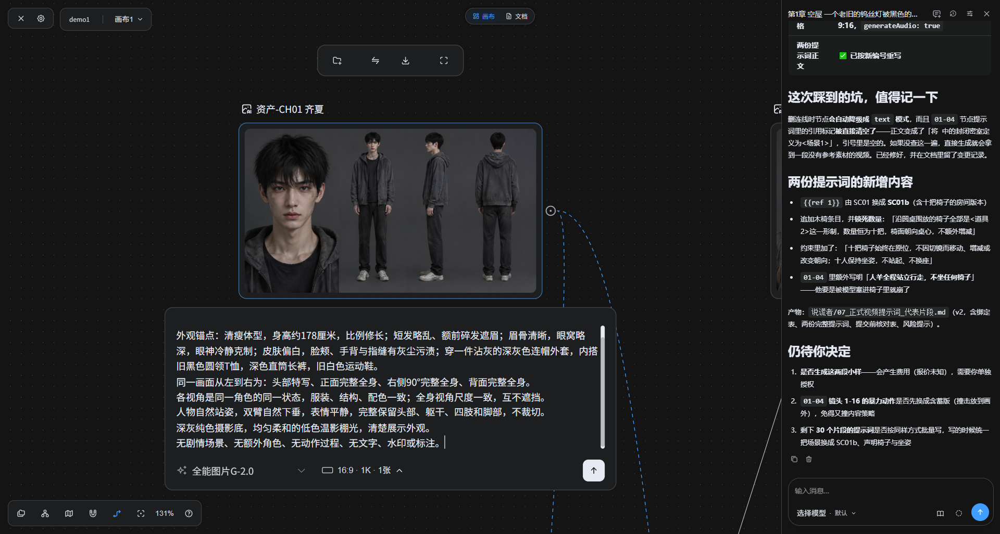</a><br /><sub>Персонажи в трёх проекциях и генерация изображений</sub>

<a href="./screenshots/videoGeneration.png">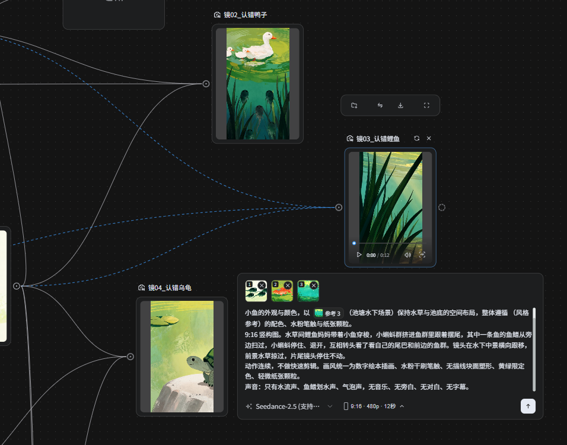</a><br /><sub>Генерация видео по нескольким референсам</sub>

<a href="./screenshots/nodeMenu.png">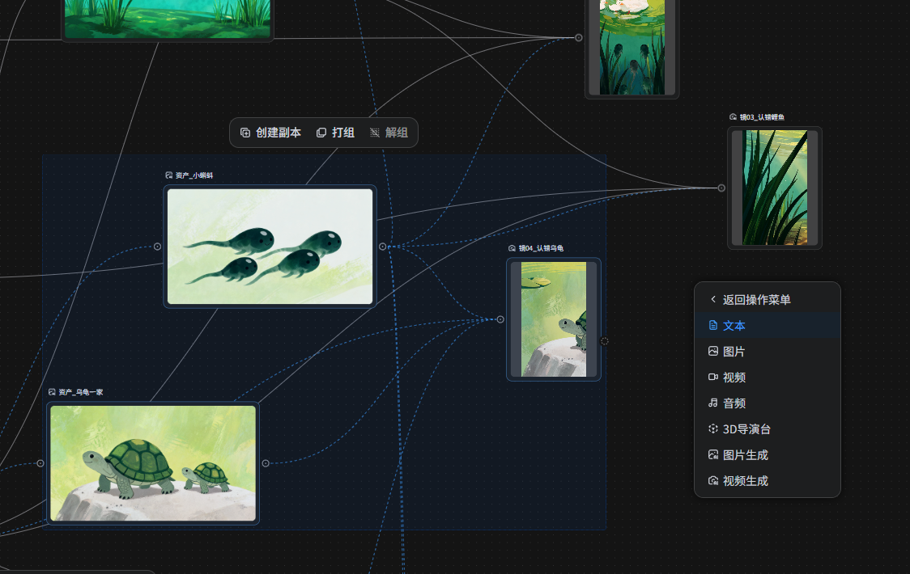</a><br /><sub>Меню узлов и операции с группами</sub>

<a href="./screenshots/pluginMarket.png">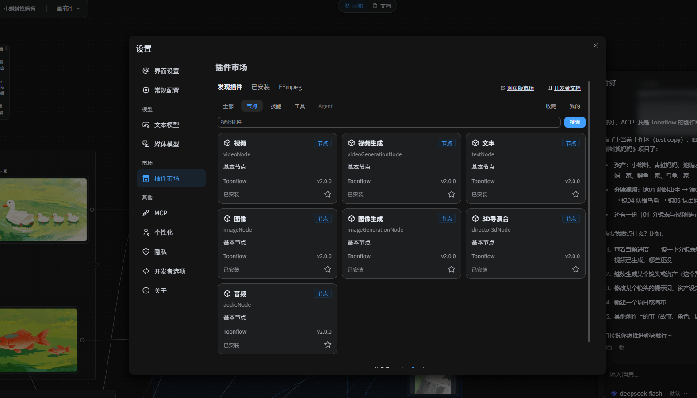</a><br /><sub>Каталог плагинов</sub>

</div>

---

## 4. 🚀 Скачивание и установка

### 4.1 Установка настольного приложения

| Операционная система | GitHub |
| --- | --- |
| Windows | [Релиз](https://github.com/HBAI-Ltd/Toonflow-app/releases) |
| macOS | [Релиз](https://github.com/HBAI-Ltd/Toonflow-app/releases) |

Установщик Windows автоматически проверяет наличие WebView2 и устанавливает его при необходимости. Если после установки приложение сразу закрывается, установите среду выполнения вручную со [страницы загрузки WebView2](https://developer.microsoft.com/microsoft-edge/webview2/).

В macOS (Apple Silicon) перетащите Toonflow в папку «Программы» и откройте приложение. Заранее выполнять команды в терминале не требуется. Если появится предупреждение системы безопасности, последовательно выполните следующие действия.

<details>
<summary><strong>Что делать, если Toonflow не устанавливается или не открывается в macOS</strong></summary>

**1. Разрешите запуск Toonflow в разделе «Конфиденциальность и безопасность»**

Если система сообщает, что не может проверить разработчика или что Apple не может проверить приложение на наличие вредоносного ПО, сначала попробуйте открыть Toonflow. Затем перейдите в «Системные настройки → Конфиденциальность и безопасность», найдите сообщение о блокировке Toonflow, нажмите «Всё равно открыть» и подтвердите действие. Подробнее — в [официальной инструкции Apple](https://support.apple.com/zh-cn/102445).

**2. Если запуск по-прежнему блокируется карантином системы, попробуйте удалить атрибут карантина**

Убедитесь, что приложение получено с официальной страницы релизов и помещено в папку «Программы». Выполните следующую команду в терминале и попробуйте открыть приложение снова. Если имя приложения или место установки отличаются, измените путь.

```bash
sudo xattr -rd com.apple.quarantine /Applications/toonflow.app
```

**3. Крайняя мера: временно разрешить приложения из любых источников**

Если первые два способа не помогли и вы доверяете источнику приложения, попробуйте выполнить:

```bash
sudo spctl --master-disable
```

Затем откройте «Системные настройки → Конфиденциальность и безопасность». В разделе безопасности выберите «Любой источник» для разрешённых источников загрузки приложений, если система предлагает такой вариант, и подтвердите действие. Доступные настройки и поддержка команды зависят от версии macOS.

Это ослабляет ограничения безопасности для всех приложений. После завершения рекомендуется снова разрешить приложения только из App Store и от установленных разработчиков.

</details>

Дополнительные инструкции приведены в [руководстве пользователя](https://bcn73rj0zcx7.feishu.cn/docx/Ps90dTzumoFppLxAHqocimGenFf?from=from_copylink).

---

### 4.2 Установка через Docker

Сначала установите Git, [Docker Engine](https://docs.docker.com/engine/install/) и Docker Compose. В Windows и macOS можно использовать Docker Desktop в режиме контейнеров Linux. В репозитории есть [Dockerfile](../Dockerfile), [конфигурация Compose](../compose.yaml) и [правила исключения файлов из сборки](../.dockerignore). Образ собирается на Bun 1.3.14 и содержит FFmpeg.

<details>
<summary><strong>Показать шаги установки через Docker</strong></summary>

Клонируйте исходный код и выполните команды в корневой папке репозитория:

```sh
git clone https://github.com/HBAI-Ltd/Toonflow-app.git
cd Toonflow-app
docker compose up -d --build
```

При первой сборке устанавливаются зависимости и собираются встроенные узлы, инструменты, Web и Server. После запуска откройте `http://127.0.0.1:3000`. Для удалённого сервера используйте SSH-туннель, описанный ниже в разделе «Доступ и данные». При первом запуске инициализируются встроенные плагины и создаётся рабочая папка `myProject`.

Настройки, плагины и файлы проектов хранятся в именованном томе Docker `toonflowData`, подключённом к `/app/data/` внутри контейнера. Фактическое имя тома содержит префикс проекта Compose. Данные сохраняются при остановке или пересборке контейнера. **Не используйте `docker compose down -v`: эта команда удаляет том с данными.**

```sh
docker compose logs -f toonflow  # Просмотр журналов
docker compose stop             # Остановка сервиса
docker compose start            # Повторный запуск
docker compose down             # Удаление контейнеров с сохранением тома данных
```

Чтобы добавить папку проекта, нажмите «Новая папка» в диалоге «Выбор рабочей папки на сервере». В этом же диалоге можно переименовывать и удалять файлы и папки. Также можно создать папку из командной строки, пока сервис запущен:

```sh
docker compose exec toonflow mkdir -p /app/data/workspaces/newProject
```

Для резервного копирования сначала остановите сервис, скопируйте данные и запустите его снова:

```sh
docker compose stop
docker compose cp toonflow:/app/data ./toonflowBackup
docker compose start
```

</details>

---

### 4.3 Установка на сервер

Этот вариант позволяет запускать Web и Server непосредственно на сервере Linux. Ниже приведён пример для Ubuntu / Debian с указанной в проекте версией [Bun 1.3.14](https://bun.sh/docs/installation).

<details>
<summary><strong>Показать шаги установки на сервер</strong></summary>

Установите среду выполнения:

```sh
sudo apt-get update
sudo apt-get install -y git curl unzip ffmpeg
curl -fsSL https://bun.com/install | bash -s "bun-v1.3.14"
export PATH="$HOME/.bun/bin:$PATH"
bun --version
```

Клонируйте исходный код и запустите сервис:

```sh
git clone https://github.com/HBAI-Ltd/Toonflow-app.git
cd Toonflow-app
bun install --frozen-lockfile

# Сборка встроенных узлов, инструментов, Web и Server
bun run build:server
mkdir -p data/workspaces/myProject
bun run start:server
```

Когда появится сообщение «服务启动成功» («Сервис успешно запущен»), откройте `http://127.0.0.1:3000` на самом сервере. Приведённая команда запускает сервис на переднем плане; для остановки нажмите `Ctrl+C`. Для автозапуска и управления процессом воспользуйтесь [руководством Bun по развёртыванию с systemd](https://bun.sh/guides/ecosystem/systemd). Укажите папку репозитория в качестве рабочего каталога, а в команде запуска — абсолютный путь к Bun и `run start:server`. Запускайте сервис от пользователя с правами чтения и записи в эту папку.

</details>

---

### 4.4 Доступ и данные

- Сервис использует фиксированный порт `3000`. У веб-интерфейса и API нет отдельной аутентификации при входе. При установке на сервер ограничьте доступ к порту `3000` с помощью межсетевого экрана или группы безопасности. Для публичного доступа необходимо настроить обратный прокси с аутентификацией.
- Для личного удалённого доступа выполните на своём компьютере `ssh -N -L 3000:127.0.0.1:3000 username@server-address`. Не закрывая соединение, откройте `http://127.0.0.1:3000`. Открывать порт `3000` сервера для всего интернета не требуется.
- При прямой установке настройки, плагины и рабочие пространства по умолчанию хранятся в папке `data/` репозитория. При установке через Docker — в `/app/data/` внутри тома данных. При переносе или резервном копировании сохраняйте всю папку целиком. Открыв страницу, выберите `myProject` в рабочем пространстве сервера. Для дополнительных проектов создавайте подпапки в соответствующей папке `workspaces/`.
- Оба способа установки включают системный FFmpeg. Ключи API сервисов моделей нужно настроить в интерфейсе.

---

### 4.5 Развёртывание в облаке

Наш партнёр [AI Galaxy (智星云)](https://www.ai-galaxy.com/) предоставляет официально авторизованный коммерческий образ Toonflow с готовым окружением. Порядок действий описан в [иллюстрированном руководстве по развёртыванию образа](https://mp.weixin.qq.com/s/lq9X1ovQ1_TKeXMOLgicKg?scene=1).

---

## 5. 🎬 Пример работы

https://github.com/user-attachments/assets/2d9fddac-dfdf-4640-b030-b09d7f7287e9

### Сведения о создании

| Параметр | Данные из исходного репозитория |
| --- | --- |
| Время работы и длительность видео | Около 2 часов работы, готовое видео — около 2 минут. |
| Видеомодель | Seedance 2.0 |
| Модель изображений | GPT Image 2 |
| Языковая модель | Claude Opus 4.6 |
| Стоимость вызовов моделей | Около ¥130 CNY (китайских юаней): примерно ¥10 за языковую модель, ¥120 за видео и менее ¥1 за изображения. |

Это зафиксированные расходы для данного примера, приведённые только для справки. Фактическая стоимость зависит от сервиса моделей, количества генераций и параметров. Демонстрационное видео сжато до 480p.

---

## 6. 🚀 TF-Router — официальный шлюз моделей

<p align="center">
  <a href="https://api.toonflow.net/">
    
  </a>
</p>

TF-Router — официальный шлюз моделей, которым управляет команда Toonflow. Приглашаем вас воспользоваться им. Исходный код платформы полностью открыт: вы можете самостоятельно развернуть её и провести аудит. Репозиторий: [HBAI-Ltd/TF-Router](https://github.com/HBAI-Ltd/TF-Router).

<details>
<summary><strong>Письмо сообществу Toonflow (опубликовано 2026-06-08)</strong></summary>

> ### Письмо сообществу Toonflow
> 130 дней.
> Немного, но достаточно, чтобы яснее увидеть некоторые вещи.
> С первого коммита до сегодняшнего дня прошло 130 дней. Мы выпустили 20 версий, сделали 800+ коммитов и написали 213,765 строк кода — 640,810 символов.
> Две переработки, система провайдеров и рабочий процесс, которым мы гордимся.
> Мы думали, что этого достаточно.
> Но этого оказалось мало.
> Нам писали, что хотят добавить в Toonflow свой модуль, но даже после долгих попыток не могут разобраться в коде.
> Нам писали, что сообщество слишком маленькое и при возникновении проблем не у кого попросить помощи.
> Нам писали, что коммерческие условия не позволяют реализовать проекты.
> Мы вас услышали.
> Все эти 130 дней участники команды по очереди дежурили в чатах, отвечая на каждый вопрос 7×24. Без спонсоров и субсидий — все расходы на работу команды мы оплачивали сами.
> Не потому, что у нас много денег.
> А потому, что мы считаем это дело стоящим.
> Поэтому мы решили провести третью переработку.
> Каждая переработка Toonflow делала проект более открытым.
> На этот раз мы выбираем полную открытость.
>
> 1. Лицензия MIT
> Мы решили, что после завершения переработки заменим Apache-2.0 на MIT License и уберём все дополнительные коммерческие условия.
> Проект будет полностью открытым, без каких-либо коммерческих ограничений.
> Вы сможете использовать его для любых целей.
>
> 2. Полностью свободная система плагинов
> Мы заново спроектируем всю архитектуру плагинов.
> Раскадровки, панорамы, временные шкалы и даже мини-игры.
> Всё, что вы сможете придумать, можно будет добавить.
> Не обходными путями, а благодаря самой архитектуре.
>
> 3. Drizzle ORM и поддержка нескольких баз данных
> Мы перейдём на Drizzle ORM.
> Локальное хранилище, PostgreSQL или MySQL — выбирайте по своим потребностям.
> Доработка проекта перестанет быть кошмаром.
>
> 4. Полный цикл работы в Monorepo
> Разработка плагинов, интеграция SDK и публикация — в едином процессе.
> Вносить вклад должно быть настолько просто, чтобы с этим мог справиться один человек.
>
> 5. Новые модули
> Бесконечный холст — не только пространство, но и свобода.
> Режим вдохновения — для тех, кто создаёт.
> Plugin Hub — чтобы хорошие плагины находили своих пользователей.
> Skill Hub — чтобы опытом можно было делиться.
> Provider Hub — начало экосистемы.
> Полная интеграция с Docker — чтобы развёртывание перестало быть препятствием.
>
> А теперь о том, о чём нам давно было неловко говорить.
> Переработка требует времени. Всё это время серверы работают, домены нужно продлевать, команда работает по ночам, а кофе дорожает.
> У нас нет инвестиций, рекламы или скрытых коммерческих планов.
> Но нам нужно оставаться на плаву, чтобы довести начатое до конца.
> Поэтому мы запустили TF-Router — официальный шлюз моделей Toonflow.
> Честно говоря, мы долго сомневались, стоит ли его создавать.
> Мы не хотели заниматься такой платформой и не хотели, чтобы из-за неё люди решили, будто Toonflow начал «наживаться».
> Эти опасения долго не давали нам покоя.
> Но многие пользователи не могли получить разрешение на доступ к Seedance 2.0 и снова и снова спрашивали, можем ли мы помочь.
> После долгих размышлений мы всё же решили создать платформу и сами заключили с Volcengine годовой рамочный договор на Seedance.
> **Одновременно мы решили во время акции предоставлять Seedance 2.0 по себестоимости, не зарабатывая ни копейки на наценке.**
> После завершения акции мы начнём брать совсем небольшую плату за обслуживание. Но сейчас главное — дать вам возможность пользоваться моделью.
> И самое важное: весь исходный код TF-Router уже опубликован и доступен открыто: 【<a href="https://github.com/HBAI-Ltd/TF-Router" target="_blank">исходный код</a>】.
> Не доверяете нам? Ничего страшного: изучите код, разверните платформу и запускайте её сами.
> Такова наша позиция.
> Если вы захотите попробовать платформу, это будет знаком доверия к единственному доступному нам сейчас способу продолжать работу.
> Если не захотите — тоже ничего страшного. Продолжайте пользоваться Toonflow, критиковать нас и предлагать новые возможности.
> Мы рядом.
> Напоследок — несколько искренних слов.
> Мы просто обычные люди, которые верят, что инструменты для творчества должны принадлежать всем.
> Toonflow никогда не был только нашим продуктом.
> Это история, которую мы пишем вместе.
> Третья переработка — не финиш.
> Это точка, с которой мы начинаем заново.
> Спасибо каждому, кто пользовался проектом, критиковал его и давал советы.
> Именно благодаря вам он дошёл до сегодняшнего дня.
> Спасибо.

</details>

---

## 7. 👨‍👩‍👧‍👦 Сообщество в WeChat

Помощник для приглашения в группу:


Также можно нажать на значок, чтобы присоединиться к Discord:

[](https://discord.gg/HEjKmpNpAZ)

Или воспользоваться приглашением: [https://discord.gg/HEjKmpNpAZ](https://discord.gg/HEjKmpNpAZ)

---

## 8. 💌 Связаться с нами

📧 Электронная почта: [ltlctools@outlook.com](mailto:ltlctools@outlook.com?subject=Toonflow咨询)

---

## 9. 📜 Лицензия открытого исходного кода

Toonflow распространяется по [лицензии MIT](../LICENSE). Сторонние зависимости и материалы регулируются собственными лицензиями и уведомлениями об авторских правах.

[](https://www.star-history.com/#HBAI-Ltd/Toonflow-app&Date)

> **Отсутствие обратной силы**: пользователи, использовавшие версии до v1.0.8 по AGPL-3.0, продолжают соблюдать AGPL-3.0. Для версий с v1.0.8 по v1.1.8 сохраняются Apache-2.0 и дополнительное соглашение. Изменение лицензии на них не распространяется.

---

## 10. 🙏 Благодарности

- **Партнёры**: 算能云, Tencent Hunyuan 3D и AI Galaxy (智星云).
- **Участники проекта**: спасибо всем, кто пишет код, улучшает документацию, делится плагинами и помогает устранять проблемы.
- **Пользователи сообщества**: спасибо всем, кто продолжает оставлять отзывы, делиться своими работами и поддерживать развитие проекта.

仰起脸笑的像满月: предоставлены вычислительные ресурсы Codex 20x для разработки.
西安中星数字智能科技有限公司: предоставлена подпись сертификатом Apple.

<div align="center">

Copyright © 2026 北京爱阿科技有限公司

</div>


