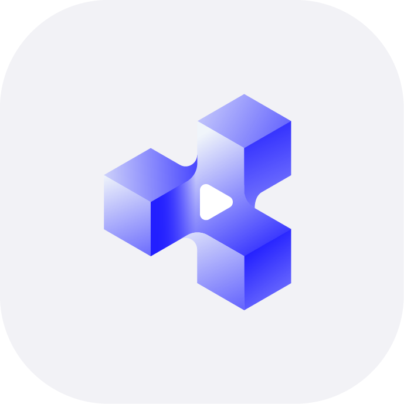

<p>
  <a href="https://github.com/HBAI-Ltd/Toonflow-app">
    
  </a>
  &nbsp;|&nbsp;
  <a href="https://gitee.com/HBAI-Ltd/Toonflow-app">
    
  </a>
  &nbsp;|&nbsp;
  <a href="https://atomgit.com/HBAI-Ltd/Toonflow-app">
    
  </a>
</p>

<p align="center">
  <a href="../README.md">简体中文</a> |
  <a href="./README.zhtw.md">繁體中文</a> |
  <a href="./README.en.md">English</a> |
  <strong>ไทย</strong> |
  <a href="./README.vi.md">Tiếng Việt</a> |
  <a href="./README.ja.md">日本語</a> |
  <a href="./README.ru.md">Русский</a>
</p>

<div align="center">

<p align="center">
  
</p>

<a href="https://git.io/typing-svg">
  <picture>
    <source media="(prefers-color-scheme: dark)" srcset="https://readme-typing-svg.demolab.com?font=Fira+Code&size=40&duration=3000&pause=1000&color=FFFFFF&center=true&vCenter=true&width=600&lines=Toonflow;AI%20Short%20Drama%20Studio;Turn%20Ideas%20into%20Stories" />
    
  </picture>
</a>

<p align="center">
  <a href="https://github.com/HBAI-Ltd/Toonflow-app/stargazers">
    
  </a>
  <a href="../LICENSE">
    
  </a>
  <a href="https://github.com/HBAI-Ltd/Toonflow-app/releases">
    
  </a>
</p>
<p align="center">
  <a href="https://github.com/HBAI-Ltd/Toonflow-app/network/members">
    
  </a>
  <a href="https://atomgit.com/HBAI-Ltd/Toonflow-app">
    
  </a>
  <a href="https://discord.gg/HEjKmpNpAZ">
    
  </a>
</p>
<p align="center">
  <a href="https://github.com/HBAI-Ltd/Toonflow-app/issues">
    
  </a>
  <a href="https://github.com/HBAI-Ltd/Toonflow-app/graphs/contributors">
    
  </a>
  <a href="https://github.com/HBAI-Ltd/Toonflow-app/commits">
    
  </a>
</p>
<p align="center">
  &nbsp;
  &nbsp;
  &nbsp;
  
</p>

<p align="center">
  <a href="https://trendshift.io/repositories/24197?utm_source=trendshift-badge&amp;utm_medium=badge&amp;utm_campaign=badge-trendshift-24197" target="_blank" rel="noopener noreferrer">
    
  </a>
</p>

**แพลตฟอร์มสร้างวิดีโอละครสั้นและการ์ตูนด้วย AI แบบโอเพนซอร์ส**

> 🚀 **สร้างละครสั้นครบในที่เดียว**: รวมการเขียนบท การจัดการทรัพยากร และการสร้างภาพกับวิดีโอ พร้อมจัดระเบียบกระบวนการสร้างสรรค์ทั้งหมดบนแคนวาสไม่จำกัด

</div>

<div align="center">
  <table>
    <tr>
      <td width="50%" align="center">
        <a href="./gStar.png">
          
        </a>
      </td>
      <td width="50%" align="center">
        <a href="./gvp.jpg">
          
        </a>
      </td>
    </tr>
  </table>
</div>

<p align="center">
  <a href="https://github.com/HBAI-Ltd/Toonflow-app/releases">ดาวน์โหลดแอป</a> ·
  <a href="https://qcn7xdsqgc4z.feishu.cn/docx/RXFqdgR2Xo0dXZxGfd0cZCGgnwf">คู่มือการใช้งาน</a> ·
  <a href="https://api.toonflow.net/console/plugIn">ตลาดปลั๊กอิน</a> ·
  <a href="https://qcn7xdsqgc4z.feishu.cn/docx/KNBNd9naqolsy6xjAOCcEAkqnRd">เอกสารสำหรับนักพัฒนา</a> ·
  <a href="https://api.toonflow.net/">แพลตฟอร์มโมเดลอย่างเป็นทางการ</a>
</p>

---

## 1. 💛 ผู้สนับสนุนและการสนับสนุน

ขอขอบคุณพันธมิตรต่อไปนี้ที่สนับสนุนโครงการโอเพนซอร์ส Toonflow

<table>
  <tr>
    <td width="50%" valign="top">
      <a href="https://metaso.cn/minimax-h3/?s=toon"> <strong>Metaso</strong></a>
      <br />
      <sub>บริการสร้างวิดีโอ MiniMax H3 ที่คุ้มค่า: 768P ราคาเพียง 0.09 หยวน/วินาที และ 2K เพียง 0.15 หยวน/วินาที รองรับความละเอียด 2K แบบเนทีฟและเสียงที่สอดคล้องกับภาพ API เข้ากันได้กับโปรโตคอล OpenAI พร้อมรองรับ ComfyUI และแคนวาสไม่จำกัด โดยไม่ต้องติดตั้ง GPU เอง <a href="https://metaso.cn/minimax-h3/?s=toon">ลงทะเบียนผ่านลิงก์พิเศษ</a>เพื่อรับเครดิตฟรีและข้อเสนอเฉพาะ สำหรับความร่วมมือทางธุรกิจ ติดต่อ WeChat: metasota12</sub>
    </td>
    <td width="50%" valign="top">
      <a href="https://go.apimart.ai/gh-toonflow-app"> <strong>APIMart</strong></a>
      <br />
      <sub>ขอขอบคุณ APIMart ที่สนับสนุนทรัพยากรประมวลผลให้โครงการนี้! แพลตฟอร์ม API ราคาประหยัดที่เน้นการสร้างภาพและวิดีโอด้วย AI โดย GPT-Image-2 เริ่มต้นเพียง $0.006/ภาพ และ 1 ดอลลาร์สร้างภาพได้มากกว่า 160 ภาพ ใช้ API แบบอะซิงโครนัสชุดเดียวสำหรับภาพและวิดีโอ ส่งงานเพื่อรับ ID และรับผลลัพธ์ผ่าน callback ประมวลผลภาพเป็นชุดนับหมื่นภาพโดยไม่หมดเวลารอ และเปลี่ยนโมเดลได้โดยไม่ต้องแก้โค้ด คิดค่าบริการตามการใช้งาน ไม่มีค่ารายเดือน เริ่มใช้งานได้ทันทีเมื่อลงทะเบียนผ่าน<a href="https://go.apimart.ai/gh-toonflow-app">ลิงก์นี้</a></sub>
    </td>
  </tr>
  <tr>
    <td width="50%" valign="top">
      <a href="https://www.compshare.cn/video-studio?ytag=GPU_YY_YX_git_toonflow"> <strong>CompShare</strong></a>
      <br />
      <sub>CompShare ให้บริการสร้างวิดีโอ H3 ที่คุ้มค่า ครอบคลุมการสร้างวิดีโอจากข้อความ การกำหนดเฟรมเริ่มต้นและเฟรมสุดท้าย และการอ้างอิงแบบรอบด้าน รองรับวิดีโอยาวสูงสุด 30 วินาทีและความละเอียด 2K แบบเนทีฟ โดย 768P ราคาเพียง 0.08 หยวนต่อวินาที รองรับการเรียกใช้ API การประมวลผลคำขอพร้อมกันจำนวนมากสำหรับองค์กร และการขอใบกำกับภาษีด้วยตนเอง</sub>
      <br /><br />
      <sub>🎁 <a href="https://www.compshare.cn/video-studio?ytag=GPU_YY_YX_git_toonflow">ลงทะเบียนผ่านลิงก์พิเศษ</a>เพื่อรับเครดิตฟรีมูลค่า 5 หยวนสำหรับทดลองใช้งานบนแพลตฟอร์ม!</sub>
    </td>
    <td width="50%" valign="top"></td>
  </tr>
</table>

<details>
<summary><strong>👉ร่วมเป็นผู้สนับสนุน👈</strong></summary>

<p align="center">
  
</p>

<p align="center"><sub>ช่องทางติดต่อนี้ใช้สำหรับประสานงานความร่วมมือทางธุรกิจเท่านั้น ไม่ให้บริการตอบคำถามการใช้งาน หากมีปัญหาการใช้งาน สามารถพูดคุยในกลุ่มชุมชน และส่งข้อเสนอหรือรายงานบั๊กผ่านแบบฟอร์มข้อเสนอแนะ ขอบคุณที่เข้าใจ</sub></p>

</details>

---

## 2. 🌟 จุดเด่น

Toonflow คือแพลตฟอร์มสร้างสรรค์ด้วย AI แบบโอเพนซอร์สสำหรับการผลิตละครสั้น วิดีโอการ์ตูน และวิดีโอสั้น โดยรวมบท ทรัพยากร และคลิปวิดีโอไว้บนแคนวาสไม่จำกัดผืนเดียว

| ความสามารถ | รายละเอียด |
| --- | --- |
| 🏠 **ติดตั้งในระบบของคุณ** | บันทึกโครงการและสื่อไว้บนอุปกรณ์หรือเซิร์ฟเวอร์ของคุณเอง รองรับการติดตั้งแบบเดสก์ท็อป Docker และเซิร์ฟเวอร์ |
| 🖼️ **แคนวาสไม่จำกัด** | จัดวางบท ตัวละคร ฉาก และคลิปวิดีโอบนแคนวาสเดียวกัน |
| 🔌 **MCP** | เชื่อมต่อเครื่องมือและบริการภายนอกผ่าน MCP |
| 🧩 **ตลาดปลั๊กอิน** | เพิ่มโหนด เครื่องมือ และความสามารถในการสร้างสรรค์ผ่าน[ตลาดปลั๊กอิน](https://api.toonflow.net/console/plugIn) |
| 🤖 **Agent แบบเปิด** | เปิดให้ปรับแต่งพรอมป์ต์และเครื่องมือ พร้อมรองรับ A2A เพื่อกำหนดพฤติกรรมของ Agent และทำงานร่วมกับ Agent ภายนอก |
| 🔧 **เชื่อมต่อโมเดลได้อย่างอิสระ** | กำหนดค่า API ของบุคคลที่สาม หรือเชื่อมต่อ ComfyUI และ LLM ที่ทำงานในเครื่อง |

---

## 3. 📸 ภาพหน้าจอ

<div align="center">

<a href="./screenshots/projectHome.png"></a><br /><sub>หน้าแรกของโครงการและการสร้างสรรค์จากแรงบันดาลใจ</sub>

<a href="./screenshots/quickStart.png"></a><br /><sub>การเปิดใช้งานครั้งแรกและการตั้งค่าอย่างรวดเร็ว</sub>

<a href="./screenshots/canvasDark.png"></a><br /><sub>แคนวาสสร้างสรรค์ · ธีมมืด</sub>

<a href="./screenshots/canvasLight.png"></a><br /><sub>แคนวาสสร้างสรรค์ · ธีมสว่าง</sub>

<a href="./screenshots/assetCanvas.png"></a><br /><sub>ทรัพยากรตัวละคร ฉาก และอุปกรณ์ประกอบ</sub>

<a href="./screenshots/directorStudio.png"></a><br /><sub>โต๊ะผู้กำกับ 3D และการพรีวิซช็อต</sub>

<a href="./screenshots/characterImageGeneration.png"></a><br /><sub>ภาพตัวละครสามมุมมองและการสร้างภาพ</sub>

<a href="./screenshots/videoGeneration.png"></a><br /><sub>การสร้างวิดีโอจากสื่ออ้างอิงหลายรายการ</sub>

<a href="./screenshots/nodeMenu.png"></a><br /><sub>เมนูโหนดและการจัดกลุ่ม</sub>

<a href="./screenshots/pluginMarket.png"></a><br /><sub>ตลาดปลั๊กอิน</sub>

</div>

---

## 4. 🚀 ดาวน์โหลดและติดตั้ง

### 4.1 การติดตั้งเดสก์ท็อป

| ระบบปฏิบัติการ | GitHub |
| -------- | ------------------------------------------------------------ |
| Windows | [รุ่นเผยแพร่](https://github.com/HBAI-Ltd/Toonflow-app/releases) |
| macOS | [รุ่นเผยแพร่](https://github.com/HBAI-Ltd/Toonflow-app/releases) |

ตัวติดตั้ง Windows จะตรวจสอบและติดตั้ง WebView2 โดยอัตโนมัติ หากแอปปิดตัวเองทันทีหลังเปิดใช้งานเมื่อติดตั้งเสร็จ ให้ไปที่[หน้าดาวน์โหลด WebView2](https://developer.microsoft.com/microsoft-edge/webview2/) เพื่อติดตั้งรันไทม์ด้วยตนเอง

บน macOS (Apple Silicon) ให้ลาก Toonflow ไปไว้ใน “แอปพลิเคชัน” แล้วเปิดใช้งานได้ทันที โดยไม่ต้องเรียกใช้คำสั่งในเทอร์มินัลล่วงหน้า หากพบคำเตือนด้านความปลอดภัยจากระบบ ให้ดำเนินการตามลำดับต่อไปนี้

<details>
<summary><strong>วิธีแก้ไขเมื่อติดตั้งหรือเปิดใช้งานบน macOS ไม่ได้</strong></summary>

**1. อนุญาต Toonflow ใน “ความเป็นส่วนตัวและความปลอดภัย”**

หากระบบแจ้งว่า “ไม่สามารถยืนยันนักพัฒนาได้” หรือ “Apple ไม่สามารถตรวจสอบว่าแอปมีซอฟต์แวร์ที่เป็นอันตรายหรือไม่” ให้ลองเปิด Toonflow ก่อน จากนั้นไปที่ “การตั้งค่าระบบ → ความเป็นส่วนตัวและความปลอดภัย” ค้นหาข้อความที่ระบุว่า Toonflow ถูกบล็อก คลิก “เปิดต่อไป” แล้วทำตามคำแนะนำเพื่อยืนยัน ดูรายละเอียดใน[คำแนะนำอย่างเป็นทางการของ Apple](https://support.apple.com/zh-cn/102445)

**2. หากยังเปิดไม่ได้เนื่องจากข้อจำกัดการกักกันของระบบ ให้ลองลบแอตทริบิวต์การกักกัน**

ตรวจสอบว่าแอปมาจากหน้าเผยแพร่อย่างเป็นทางการและอยู่ใน “แอปพลิเคชัน” แล้วเรียกใช้คำสั่งต่อไปนี้ในเทอร์มินัล จากนั้นลองเปิดอีกครั้ง หากชื่อแอปหรือตำแหน่งติดตั้งต่างออกไป ให้ปรับเส้นทางให้ตรงกัน

```bash
sudo xattr -rd com.apple.quarantine /Applications/toonflow.app
```

**3. วิธีสุดท้าย: อนุญาตแอปจากทุกแหล่งเป็นการชั่วคราว**

หากสองวิธีแรกไม่ได้ผลและยืนยันได้ว่าแหล่งที่มาของแอปเชื่อถือได้ ให้ลองเรียกใช้คำสั่งนี้ในเทอร์มินัล:

```bash
sudo spctl --master-disable
```

จากนั้นเปิด “การตั้งค่าระบบ → ความเป็นส่วนตัวและความปลอดภัย” ในส่วน “ความปลอดภัย” ตั้งค่า “อนุญาตแอปพลิเคชันที่ดาวน์โหลดจาก” เป็น “ทุกที่” (หากระบบมีตัวเลือกนี้) และยืนยันตามคำแนะนำ ตัวเลือกและการรองรับคำสั่งอาจแตกต่างกันตามเวอร์ชัน macOS

การดำเนินการนี้จะผ่อนคลายข้อจำกัดด้านความปลอดภัยสำหรับแอปทั้งหมด หลังเสร็จสิ้น แนะนำให้เปลี่ยนแหล่งที่อนุญาตกลับเป็น “App Store และนักพัฒนาที่ระบุได้”

</details>

ดูคำแนะนำเพิ่มเติมได้ใน[คู่มือการใช้งาน](https://qcn7xdsqgc4z.feishu.cn/docx/RXFqdgR2Xo0dXZxGfd0cZCGgnwf)

---

### 4.2 การติดตั้งด้วย Docker

ติดตั้ง Git, [Docker Engine](https://docs.docker.com/engine/install/) และ Docker Compose ก่อน สำหรับ Windows / macOS สามารถใช้ Docker Desktop ในโหมดคอนเทนเนอร์ Linux ได้ ที่เก็บโค้ดมี [Dockerfile](../Dockerfile), [การกำหนดค่า Compose](../compose.yaml) และ[กฎยกเว้นไฟล์สำหรับการบิลด์](../.dockerignore) โดยบิลด์ด้วย Bun 1.3.14 และมี FFmpeg รวมอยู่ในอิมเมจ

<details>
<summary><strong>แสดงขั้นตอนการติดตั้งด้วย Docker</strong></summary>

หลังโคลนซอร์สโค้ด ให้เรียกใช้คำสั่งต่อไปนี้ที่ไดเรกทอรีรากของที่เก็บโค้ด:

```sh
git clone https://github.com/HBAI-Ltd/Toonflow-app.git
cd Toonflow-app
docker compose up -d --build
```

การบิลด์ครั้งแรกจะติดตั้งแพ็กเกจที่จำเป็นและคอมไพล์โหนด เครื่องมือ Web และ Server ที่มาพร้อมระบบ เมื่อเริ่มทำงานแล้ว ให้เปิด `http://127.0.0.1:3000` หากเป็นเครื่องระยะไกล สามารถเข้าถึงผ่าน SSH tunnel ตามหัวข้อ “การเข้าถึงและข้อมูล” ด้านล่าง การเริ่มทำงานครั้งแรกจะตั้งค่าปลั๊กอินที่มาพร้อมระบบและจัดเตรียมไดเรกทอรีทำงาน `myProject`

การตั้งค่า ปลั๊กอิน และไฟล์โครงการจะถูกบันทึกใน named volume ของ Docker ชื่อ `toonflowData` ซึ่งเมานต์ไปยัง `/app/data/` ในคอนเทนเนอร์ ชื่อวอลุ่มจริงจะมีชื่อโครงการ Compose เป็นคำนำหน้า การหยุดหรือสร้างคอนเทนเนอร์ใหม่จะยังคงเก็บข้อมูลไว้ **ห้ามใช้ `docker compose down -v` เพราะคำสั่งนี้จะลบวอลุ่มข้อมูล**

```sh
docker compose logs -f toonflow  # ดูบันทึกการทำงาน
docker compose stop             # หยุดบริการ
docker compose start            # เริ่มทำงานอีกครั้ง
docker compose down             # ลบคอนเทนเนอร์ แต่เก็บวอลุ่มข้อมูลไว้
```

หากต้องการเพิ่มไดเรกทอรีโครงการ ให้คลิก “สร้างโฟลเดอร์ใหม่” ในกล่องโต้ตอบ “เลือกไดเรกทอรีทำงานบนเซิร์ฟเวอร์” บนหน้าเว็บ กล่องโต้ตอบยังรองรับการเปลี่ยนชื่อและลบไฟล์หรือโฟลเดอร์ นอกจากนี้ยังสร้างผ่านบรรทัดคำสั่งได้ขณะบริการกำลังทำงาน:

```sh
docker compose exec toonflow mkdir -p /app/data/workspaces/newProject
```

เมื่อต้องการสำรองข้อมูล ให้หยุดบริการก่อน และเริ่มใหม่หลังคัดลอกเสร็จ:

```sh
docker compose stop
docker compose cp toonflow:/app/data ./toonflowBackup
docker compose start
```

</details>

---

### 4.3 การติดตั้งบนเซิร์ฟเวอร์

สำหรับการรัน Web และ Server บนเซิร์ฟเวอร์ Linux โดยตรง ตัวอย่างต่อไปนี้ใช้ Ubuntu / Debian และ [Bun 1.3.14](https://bun.sh/docs/installation) ตามเวอร์ชันที่โครงการกำหนด

<details>
<summary><strong>แสดงขั้นตอนการติดตั้งบนเซิร์ฟเวอร์</strong></summary>

ติดตั้งสภาพแวดล้อมรันไทม์:

```sh
sudo apt-get update
sudo apt-get install -y git curl unzip ffmpeg
curl -fsSL https://bun.com/install | bash -s "bun-v1.3.14"
export PATH="$HOME/.bun/bin:$PATH"
bun --version
```

โคลนซอร์สโค้ดและเริ่มทำงาน:

```sh
git clone https://github.com/HBAI-Ltd/Toonflow-app.git
cd Toonflow-app
bun install --frozen-lockfile

# บิลด์โหนด เครื่องมือ Web และ Server ที่มาพร้อมระบบ
bun run build:server
mkdir -p data/workspaces/myProject
bun run start:server
```

เมื่อเห็นข้อความ “บริการเริ่มทำงานสำเร็จ” (`服务启动成功`) สามารถเปิด `http://127.0.0.1:3000` จากตัวเซิร์ฟเวอร์ได้ คำสั่งข้างต้นรันในโหมดเบื้องหน้า กด `Ctrl+C` เพื่อหยุด หากต้องการเริ่มอัตโนมัติเมื่อบูตและจัดการโพรเซส โปรดดู[คู่มือการติดตั้ง Bun ด้วย systemd](https://bun.sh/guides/ecosystem/systemd) โดยกำหนดไดเรกทอรีทำงานเป็นไดเรกทอรีของที่เก็บโค้ด และกำหนดคำสั่งเริ่มต้นเป็นเส้นทางแบบสัมบูรณ์ของ Bun ตามด้วย `run start:server` ใช้บัญชีผู้ใช้ที่มีสิทธิ์อ่านและเขียนไดเรกทอรีดังกล่าว

</details>

---

### 4.4 การเข้าถึงและข้อมูล

- ปัจจุบันบริการใช้พอร์ตคงที่ `3000` และหน้าใช้งานกับ API ไม่มีระบบยืนยันตัวตนผ่านการเข้าสู่ระบบแยกต่างหาก เมื่อติดตั้งบนเซิร์ฟเวอร์ ให้จำกัดแหล่งที่เข้าถึงพอร์ต `3000` ผ่านไฟร์วอลล์หรือกลุ่มความปลอดภัย หากเปิดให้เข้าถึงผ่านอินเทอร์เน็ต ต้องตั้งค่า reverse proxy ที่มีการยืนยันตัวตน
- สำหรับการใช้งานส่วนตัวจากระยะไกล ให้เรียกใช้ `ssh -N -L 3000:127.0.0.1:3000 用户名@服务器地址` บนคอมพิวเตอร์ของคุณ โดยแทน `用户名` ด้วยชื่อผู้ใช้และ `服务器地址` ด้วยที่อยู่เซิร์ฟเวอร์ คงการเชื่อมต่อไว้แล้วเปิด `http://127.0.0.1:3000` โดยไม่ต้องเปิดพอร์ต `3000` ของเซิร์ฟเวอร์สู่อินเทอร์เน็ต
- เมื่อติดตั้งโดยตรง การตั้งค่า ปลั๊กอิน และพื้นที่ทำงานจะถูกบันทึกไว้ใน `data/` ของที่เก็บโค้ดโดยค่าเริ่มต้น ส่วนการติดตั้งด้วย Docker จะบันทึกใน `/app/data/` ภายในวอลุ่มข้อมูล โปรดเก็บข้อมูลทั้งหมดไว้เมื่อย้ายระบบหรือสำรองข้อมูล หลังเปิดหน้าเว็บ ให้เลือก `myProject` ภายในพื้นที่ทำงานบนเซิร์ฟเวอร์ และสร้างไดเรกทอรีย่อยใน `workspaces/` ที่เกี่ยวข้องสำหรับโครงการเพิ่มเติม
- การติดตั้งทั้งสองวิธีมี FFmpeg ของระบบรวมอยู่แล้ว แต่ยังต้องกำหนดค่า API Key ของบริการโมเดลผ่านหน้าเว็บ

---

### 4.5 การติดตั้งบนแพลตฟอร์มคลาวด์

แพลตฟอร์มพันธมิตร [AI-Galaxy (智星云)](https://www.ai-galaxy.com/) ให้บริการอิมเมจ Toonflow เชิงพาณิชย์ที่ได้รับอนุญาตอย่างเป็นทางการ พร้อมสภาพแวดล้อมที่ติดตั้งไว้แล้ว ดูขั้นตอนใน[คู่มือติดตั้งอิมเมจพร้อมภาพประกอบ](https://mp.weixin.qq.com/s/lq9X1ovQ1_TKeXMOLgicKg?scene=1)

---

## 5. 🎬 ตัวอย่างผลงาน

https://github.com/user-attachments/assets/2d9fddac-dfdf-4640-b030-b09d7f7287e9

### ข้อมูลตัวอย่าง

| รายการ | บันทึกจากที่เก็บโค้ดต้นฉบับ |
| -------------- | --------------------------------------------------- |
| เวลาผลิตและความยาวผลงาน | ประมาณ 2 ชั่วโมง ได้วิดีโอสำเร็จยาวประมาณ 2 นาที |
| โมเดลวิดีโอ | Seedance 2.0 |
| โมเดลภาพ | GPT Image 2 |
| โมเดลภาษา | Claude Opus 4.6 |
| ค่าเรียกใช้โมเดล | ประมาณ ¥130 แบ่งเป็นโมเดลภาษาประมาณ ¥10 วิดีโอประมาณ ¥120 และภาพน้อยกว่า ¥1 (ทั้งหมดเป็นเงินหยวนจีน CNY) |

ค่าใช้จ่ายนี้เป็นบันทึกของตัวอย่างดังกล่าวเพื่อใช้อ้างอิงเท่านั้น ค่าใช้จ่ายจริงขึ้นอยู่กับบริการโมเดล จำนวนครั้งที่สร้าง และพารามิเตอร์ วิดีโอสาธิตเป็นเวอร์ชันที่บีบอัดเป็น 480p

---

## 6. 🚀 TF-Router แพลตฟอร์มตัวกลางอย่างเป็นทางการ

<p align="center">
  <a href="https://api.toonflow.net/">
    
  </a>
</p>

TF-Router คือแพลตฟอร์มตัวกลางสำหรับโมเดลอย่างเป็นทางการที่ Toonflow ดำเนินการเอง ยินดีต้อนรับทุกท่านให้ลองใช้งาน ซอร์สโค้ดของแพลตฟอร์มเปิดเผยทั้งหมด และสามารถติดตั้งเองเพื่อตรวจสอบได้: [HBAI-Ltd/TF-Router](https://github.com/HBAI-Ltd/TF-Router)

<details>
<summary><strong>จดหมายถึงชุมชน Toonflow (เผยแพร่เมื่อ 2026-06-08)</strong></summary>

> ### จดหมายถึงชุมชน Toonflow
> 130 วัน
> ไม่นานนัก แต่เพียงพอที่จะทำให้เราเห็นบางสิ่งชัดเจนขึ้น
> ตั้งแต่ส่งโค้ดบรรทัดแรกจนถึงวันนี้ เราเดินทางมาแล้ว 130 วัน เผยแพร่ไป 20 เวอร์ชัน มีมากกว่า 800 commits เขียนโค้ด 213,765 บรรทัด รวม 640,810 ตัวอักษร
> ปรับโครงสร้างครั้งใหญ่สองครั้ง ระบบผู้ให้บริการหนึ่งชุด และกระบวนการทำงานที่เราภูมิใจ
> เราเคยคิดว่าแค่นี้คงเพียงพอแล้ว
> แต่ยังไม่พอ
> มีคนบอกเราว่าอยากเพิ่มโมดูลของตัวเองใน Toonflow แต่ใช้เวลาแก้อยู่นานก็ยังไม่เข้าใจ
> มีคนบอกเราว่าชุมชนเล็กเกินไป เมื่อเจอปัญหาก็หาใครช่วยไม่ได้
> มีคนบอกเราว่าข้อกำหนดเชิงพาณิชย์ทำให้โครงการของพวกเขานำไปใช้จริงไม่ได้
> เรารับฟังแล้ว
> ตลอด 130 วันที่ผ่านมา สมาชิกทีมผลัดกันอยู่ในกลุ่มเพื่อตอบทุกคำถามตลอด 7×24 ชั่วโมง ไม่มีผู้สนับสนุน ไม่มีเงินอุดหนุน ต้นทุนแรงงานทั้งหมดมาจากเงินของเราเอง
> ไม่ใช่เพราะเรามีเงินมากมาย
> แต่เพราะเราเชื่อว่าสิ่งนี้คุ้มค่าที่จะทำ
> เราจึงตัดสินใจปรับโครงสร้างครั้งที่สาม
> ทุกครั้งที่ Toonflow ปรับโครงสร้าง เราจะก้าวไปสู่การเป็นโอเพนซอร์สและเปิดกว้างมากขึ้น
> ครั้งนี้ เราเลือกที่จะเปิดอย่างเต็มที่
> 　
> 1. MIT License
> หลังปรับโครงสร้างเสร็จ เราตัดสินใจเปลี่ยนสัญญาอนุญาตจาก Apache-2.0 เป็น MIT License และยกเลิกข้อกำหนดเพิ่มเติมเชิงพาณิชย์ทั้งหมด
> โครงการจะเปิดอย่างเต็มที่ โดยไม่มีข้อจำกัดเชิงพาณิชย์ใด ๆ
> คุณสามารถนำไปทำอะไรก็ได้
> 　
> 2. ระบบปลั๊กอินที่ให้อิสระอย่างเต็มที่
> เราจะออกแบบสถาปัตยกรรมปลั๊กอินทั้งหมดใหม่
> สตอรีบอร์ด ภาพพาโนรามา ไทม์ไลน์ หรือแม้แต่เกมขนาดเล็ก
> หากคุณคิดได้ ก็เพิ่มเข้ามาได้
> ไม่ใช่การดัดแปลงฝืนระบบ แต่เป็นสิ่งที่ออกแบบมาให้ทำได้
> 　
> 3. Drizzle ORM + รองรับหลายฐานข้อมูล
> อัปเกรดเป็น Drizzle ORM
> เลือกใช้ฐานข้อมูลในเครื่อง PostgreSQL หรือ MySQL ได้ตามความต้องการ
> การพัฒนาต่อยอดจะไม่เป็นฝันร้ายอีกต่อไป
> 　
> 4. Monorepo ที่เชื่อมต่อครบทุกขั้นตอน
> ตั้งแต่พัฒนาปลั๊กอิน ผสาน SDK จนถึงเผยแพร่ใช้งาน ครบในกระบวนการเดียว
> ทำให้การมีส่วนร่วมง่ายพอที่คนคนเดียวก็ทำได้
> 　
> 5. โมดูลใหม่
> แคนวาสไม่จำกัด — ไม่ใช่แค่พื้นที่กว้าง แต่คืออิสระ
> โหมดแรงบันดาลใจ — สร้างมาเพื่อผู้สร้างสรรค์
> Plugin Hub — ให้ปลั๊กอินดี ๆ ได้รับการมองเห็น
> Skill Hub — เพื่อส่งต่อประสบการณ์
> Provider Hub — จุดเริ่มต้นของระบบนิเวศ
> การผสาน Docker อย่างครบถ้วน — การติดตั้งจะไม่เป็นอุปสรรคอีกต่อไป
> 　
> ต่อไป เราขอพูดเรื่องหนึ่งที่รู้สึกลำบากใจมาตลอด
> การปรับโครงสร้างต้องใช้เวลา ระหว่างนั้นเซิร์ฟเวอร์ยังทำงาน โดเมนยังต้องต่ออายุ ทีมยังทำงานดึก และกาแฟก็แพงขึ้น
> เราไม่มีเงินลงทุน ไม่มีโฆษณา และไม่มีแผนธุรกิจแอบแฝงใด ๆ
> แต่เราต้องอยู่ต่อให้ได้ จึงจะทำสิ่งนี้จนเสร็จ
> เราจึงเปิดตัว TF-Router “แพลตฟอร์มตัวกลางอย่างเป็นทางการของ Toonflow”
> พูดตามตรง เราลังเลเรื่องแพลตฟอร์มนี้อยู่นานมาก
> นี่ไม่ใช่แพลตฟอร์มที่เราอยากทำ เราไม่อยากให้ผู้คนรู้สึกว่า Toonflow เริ่มทำเพื่อหาเงินเพียงเพราะมีบริการตัวกลาง
> เราแบกความกังวลนี้มานาน
> แต่ผู้ใช้หลายคนไม่ได้รับสิทธิ์เข้าถึง จึงใช้ Seedance 2.0 ไม่ได้ และถามเราซ้ำ ๆ ว่ามีวิธีไหม
> หลังคิดอยู่นานและไม่พบทางเลือกอื่น เราจึงตัดสินใจสร้างขึ้นเอง และลงนามสัญญากรอบรายปีสำหรับ Seedance กับ Volcengine ด้วยตัวเราเอง
> **พร้อมกันนี้ เราตัดสินใจให้บริการ Seedance 2.0 ในราคาต้นทุนตลอดช่วงกิจกรรมของแพลตฟอร์ม โดยไม่บวกกำไรแม้แต่สตางค์เดียว**
> หลังสิ้นสุดกิจกรรม เราจะเก็บค่าบริการเล็กน้อยตามปกติ แต่ตอนนี้ ขอให้ทุกคนได้ใช้งานก่อน
> ที่สำคัญยิ่งกว่านั้น ซอร์สโค้ดทั้งหมดของ TF-Router เปิดเผยและจัดแพ็กเกจไว้แล้ว【<a href="https://github.com/HBAI-Ltd/TF-Router" target="_blank">ที่เก็บซอร์สโค้ด</a>】
> หากคุณไม่เชื่อใจเรา ก็ไม่เป็นไร คุณสามารถตรวจดูโค้ด ติดตั้ง และรันด้วยตัวเองได้
> นี่คือจุดยืนของเรา
> หากคุณยินดีลองใช้งาน นั่นคือการมอบความไว้วางใจให้กับวิธีเดียวที่ช่วยให้เราดำเนินงานต่อได้ในตอนนี้
> หากคุณไม่ต้องการ ก็ไม่เป็นไร ใช้ Toonflow ต่อไป วิจารณ์เราต่อไป และเสนอสิ่งที่ต้องการต่อไป
> เรายังคงอยู่ตรงนี้
> สุดท้าย ขอพูดจากใจสักประโยค
> เราเป็นเพียงคนธรรมดากลุ่มหนึ่งที่เชื่อว่า “เครื่องมือสร้างสรรค์ควรเป็นของทุกคน”
> Toonflow ไม่เคยเป็นผลิตภัณฑ์ของเราเพียงฝ่ายเดียว
> มันคือเรื่องราวที่เราเขียนร่วมกัน
> การปรับโครงสร้างครั้งที่สามไม่ใช่จุดสิ้นสุด
> แต่เป็นจุดที่เราเริ่มต้นใหม่
> ขอบคุณทุกคนที่เคยใช้ เคยวิจารณ์ และเคยให้คำแนะนำ
> พวกคุณคือเหตุผลที่ทำให้โครงการมาถึงวันนี้ได้
> ขอบคุณทุกคน

</details>

---

## 7. 👨‍👩‍👧‍👦 กลุ่มชุมชน WeChat

ผู้ช่วยสำหรับเข้าร่วมกลุ่ม:


คลิกไอคอนเพื่อเข้าร่วม Discord ได้เช่นกัน:

[](https://discord.gg/HEjKmpNpAZ)

หรือใช้ลิงก์เชิญ: [https://discord.gg/HEjKmpNpAZ](https://discord.gg/HEjKmpNpAZ)

---

## 8. 💌 ติดต่อเรา

📧 อีเมล: [ltlctools@outlook.com](mailto:ltlctools@outlook.com?subject=Toonflow咨询)

---

## 9. 📜 สัญญาอนุญาตโอเพนซอร์ส

Toonflow ใช้[สัญญาอนุญาต MIT](../LICENSE) ส่วนแพ็กเกจและสื่อของบุคคลที่สามอยู่ภายใต้สัญญาอนุญาตและประกาศลิขสิทธิ์ของตน

[](https://www.star-history.com/#HBAI-Ltd/Toonflow-app&Date)

> **ข้อกำหนดไม่มีผลย้อนหลัง**: ผู้ใช้ที่ใช้งานภายใต้ AGPL-3.0 ก่อนการเผยแพร่ v1.0.8 ยังคงอยู่ภายใต้ AGPL-3.0 ส่วนเวอร์ชัน v1.0.8 ~ v1.1.8 ยังคงอยู่ภายใต้ Apache-2.0 และข้อตกลงเพิ่มเติม โดยไม่ได้รับผลจากการเปลี่ยนแปลงสัญญาอนุญาตครั้งนี้

---

## 10. 🙏 กิตติกรรมประกาศ

- **พันธมิตร**: 算能云 (SuanNeng Cloud), Tencent Hunyuan 3D และ AI-Galaxy (智星云)
- **ผู้ร่วมพัฒนาโครงการ**: ขอขอบคุณทุกคนที่ร่วมพัฒนาโค้ด ปรับปรุงเอกสาร แบ่งปันปลั๊กอิน และช่วยตรวจสอบปัญหา
- **ผู้ใช้ในชุมชน**: ขอขอบคุณผู้ใช้ทุกคนที่ให้ข้อเสนอแนะอย่างต่อเนื่อง แบ่งปันผลงานสร้างสรรค์ และสนับสนุนการพัฒนาโครงการ

仰起脸笑的像满月: สนับสนุนทรัพยากรประมวลผลสำหรับการพัฒนาด้วย Codex 20x
西安中星数字智能科技有限公司: สนับสนุนการลงนามด้วยใบรับรอง Apple

<div align="center">

ลิขสิทธิ์ © 2026 北京爱阿科技有限公司

</div>


